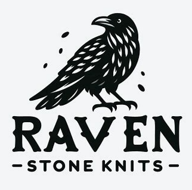
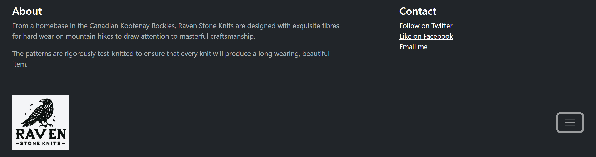
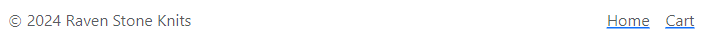
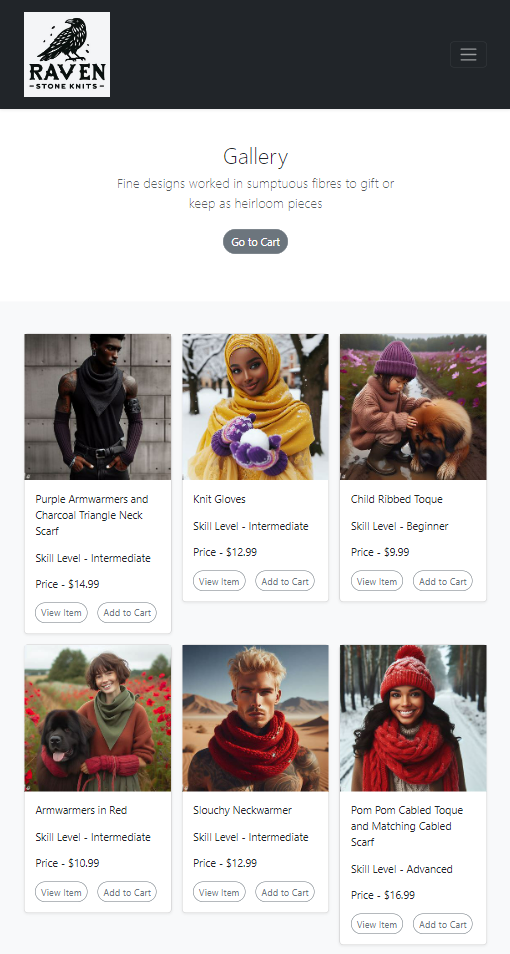
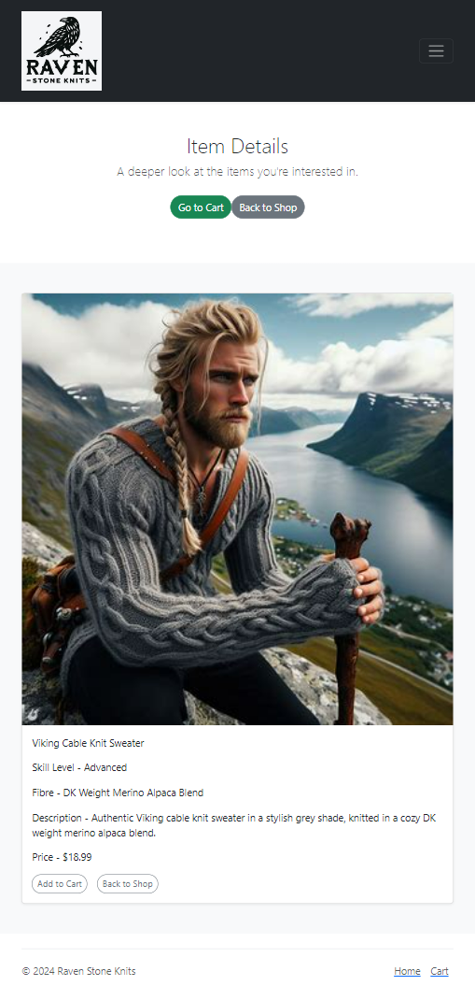
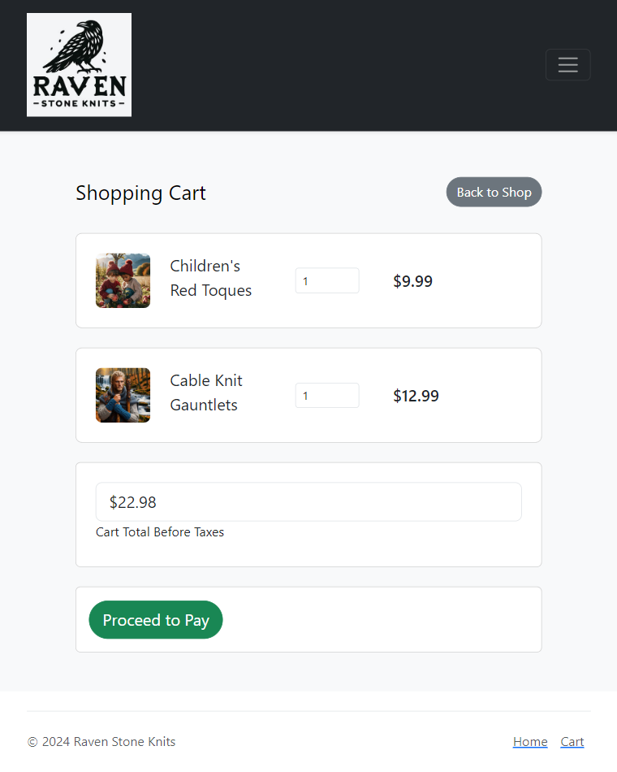

# Raven Stone Knits

## Overview

Thank you very kindly for taking the time to look at the Capstone project I've created to demostrate the skills I've acquired in the BrainStation Web Development Bootcamp.

Raven Stone Knits is a full-stack, responsive site for visitors to find hand knitting patterns to make clothing accessories for men and women.

### Problem

I produce fine quality knitwear accessories which are highly sought after by the people who see them. The problem is, I don't have the time to personally knit items for everyone who would like to own something of mine. A few people have talked me into custom orders for them, and though it's rewarding to see how happy they are, it's extremely time-consuming and not economical for me to fulfill knitwear orders on a one-to-one basis.

### Solution

I've built an e-commerce website called Raven Stone Knits to be able to display and sell my knitting patterns to a worldwide audience. Visitors to Raven Stone Knits will be able to see images of the completed knit items, learn what skill level, fibre type and tools are needed to complete and item, then purchase a PDF of the pattern for themselves.

### Visitor Profile

Any skill level of hand knitter will be able to select and purchase a pattern from my website to be able to produce a high quality clothing accessory. The pattern will give specific guidance about which fibers and tools can be used to create the best product. The person who purchases the pattern might be someone who's a knitter themselves, or they can find someone to follow the pattern and make the item for them.

### Features

-Site visitors can find information and select patterns to suit their skill level, choosing from Beginner, Intermediate or Advanced level patterns.

-Site visitors can find information and select patterns according to type of fibre, a very personal choice that can make or break one's enjoyment of the production process. They will be able to choose between merino, alpaca, or various blends.

-Site visitors can view available patterns in a gallery on the landing page that features a product photo, price, fibre type and skill level needed for production.

-Site visitors can add products to a shopping cart from the Gallery or from the Single Item Page, then navigate to the Shopping Cart Page to review their selections and total before purchasing.

### Tech Stack

- React
- MySQL
- Express
- Bootstrap 5
- Client libraries:
  - React
  - React-router
  - Axios
- Server libraries:
  - KNEX
  - Express

### APIs

- No external API's will be used for this project, but will likely be added later so that site visitors can access libraries of knit stitches and/or videos of stitches or techniques.

### Sitemap

#### Header

- A HEADER with the website logo for Raven Stone Knits, (which also functions as a clickable navigation link to allow the visitor to return to the Landing Page from any other page in the site);
- Clicking the hamburger on the right-hand-side of the header will allow the visitor to view a brief intro to describe the products available, and social media links.

#### Footer

- A FOOTER with clickable links to allow the visitor to return to the Landing Page or the Cart Page.

#### Landing Page

- A heading under the title 'GALLERY' gives a one sentence description of the items pictured below.
- Underneath the Gallery description is a 'Go To Cart' button, which is a clickable link that will allow visitors to navigate to the Cart Page, where they will be able to review their selected items.
- A GALLERY of photos of finished examples of the hand knit item patterns; the title of each item will be listed, along with the skill level needed to complete the project and the price of the pattern.
- Two clickable buttons are underneath each item:
- One button called 'View Item' allows visitors to navigate to the Single Item Page where they will be able to take a deeper look at the item to decide if they wish to purchase it.
- A second button called 'Add to Cart' will allow the visitor to add an item to their shopping cart. Their selected item(s) will then be viewable on the Cart Page after clicking the 'Go to Cart' button at the top of the Gallery or in the Footer.

#### Single Item Page

- Clicking on a Gallery Item will lead to an Single Item Page which will contain a larger image of the finished knit item, the title of the item, the skill level needed to make the item, the type of fibre used, a description of the item and the price.
- In the near future, more photos of the item will be available, alongside a more specific breakdown of the required tools and optional fibre choices.
- Clicking the 'Add to Cart' button will allow the visitor to add that item to their shopping cart.
- Clicking the 'Back to Shop' button will allow the visitor to navigate back to the Landing Page.
- Clicking the 'Go to Cart' button will allow the visitor to navigate to the Cart Page and view their selected items there.

#### Shopping Cart Page

SHOPPING CART PAGE:

- When the site visitor hit the Go To Cart buttone from the top of the Gallery or the Footer, they will be taken to the Shopping Cart page, where they will be able to review the items in their cart and their price before deciding whether or not to make a purchase.

### Data

Data will be stored in MySQL tables, which will be served to the client side through KNEX and Express.js. There will be a second table to store the client shopping cart, and a third table to store the data in that cart for the website owner to be able to monitor and track.

## Next Steps

- Visitor 'Sign Up' and 'Log In' pages with authentication will be added so that return customers will be able to store shopping carts long term, and to allow repeat customers to be rewarded with discounts after 'x' number of purchases.
- A discount code section will be added for visitors to be able to take advantage of flash sales and promotions offered through other sites.
- A fully functional checkout page will be added to the site to allow visitors to see the final total including combined price of all items and taxes. When payment is complete, they will have PDF(s) sent to their e-mail adresses.
- A 'New Additions' page will be added so that returning, long-time customers will easily be able to navigate to the most recent items added to Raven Stone Knits.
- In the near future, site visitors will be able to navigate from links on the header to social media accounts linked to the page, where they can see more photos of the knitwear.
- A clickable link will be added so that site visitors will be able to contact the site owner through contact details, most likely an email address, posted on the bottom of the landing page.
- The final functionality will be the ability of site visitors to receive a pdf of the patterns they have purchased once they have paid for the items in their cart.

## Installing Raven Stone Knits Locally

Getting Started:

First:

The computer you are using will need to already have Node,npm and MySQL installed.

Then:

Download or clone the lee-white-capstone (client) AND the lee-white-capstone-api (server) repos.

FOR THE BACKEND:

1. Create a new MySQL databse called ravenstone.

2. Install the server dependencies:
   Run 'npm install' from inside the directory.

   $ cd server
   $ npm install

3. Run migrations:

   $ npm run migrate

4. Run seeds:

   $ npm run seed

5. Set the environment variables:

   Rename .env_sample to .env and change placeholder values with your own.

   PORT=<PORT_NUMER>
   JWT_SECRET=<SECRET KEY>
   DB_HOST=<HOST ADDRESS>
   DB_USER=<YOUR DB USERNAME>
   DB_PSWD=<YOUR DB PASSWORD>

6. Start the server:

   $ node index.js

FOR THE FRONTEND:

7. Install client dependencies:

   Run 'npm install' from inside the client directory.

   $ cd ../client
   $ npm install

8. Set the environment variables:

   Rename .env_sample to .env and change the placeholder value to the port you set for the server.

   REACT_APP_API_URL=http://localhost:<PORT SET IN /server/.env>

9. Start the React app:

   $npm start
